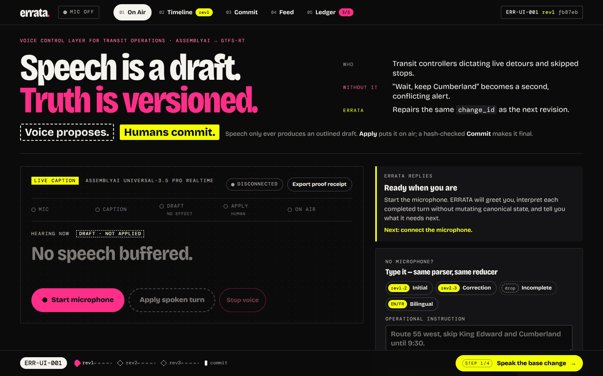

<h1 align="center">ERRATA</h1>

<strong>Voice control for transit operations — without letting speech create a second operational truth.</strong>

Speech is a draft. Truth is versioned.

  <a href="https://errata-beige.vercel.app/"><strong>Live Demo</strong></a>
  ·
  <a href="evidence/README.md"><strong>Evidence</strong></a>
  ·
  <a href="docs/BROWSER-VOICE-PROOF-PROTOCOL-v0.1.md"><strong>Browser Proof Protocol</strong></a>
  ·
  <a href="docs/PUBLIC-NETWORK-STO-EVIDENCE-v0.1.md"><strong>GTFS-RT / Public-Network Proof</strong></a>

AssemblyAI Voice Agent Hackathon · FastAPI + Vercel · deterministic state reducer · GTFS-Realtime

  

## Submission snapshot

**Category:** Voice Assistant

**Actual technology stack used by ERRATA:**

| Layer | Technology | Role |
|---|---|---|
| Live speech input | **AssemblyAI Universal-3.5 Pro Realtime** | Browser microphone transcription and realtime turn handling |
| Realtime transport | **AssemblyAI WebSocket Streaming v3** | Live audio → transcript stream |
| Product voice output | **AI33 Pro → ElevenLabs TTS** | Operator guidance / spoken ERRATA responses |
| Application backend | **Python + FastAPI** | Shared deterministic product core and public API |
| Operational state | **Deterministic parser / resolver / validators / reducer** | Versioned canonical ServiceChange state |
| Transit output | **GTFS-Realtime protobuf** | Downstream service-change consequence |
| Public runtime | **Vercel** | Judge-facing deployment |
| Browser UI | **JavaScript / HTML / CSS** | Live Caption operator surface |
| Optional phone transport | **Bandwidth** | Telephony adapter into the same core |

**Public demo:** https://errata-beige.vercel.app/

**Repository:** https://github.com/Faadil1/ERRATA

**Production code proof:** the deployed Live Caption runtime was verified on commit `5bc291c4efa7bfde4124988e7752f8f5beadccc8`. The subsequent submission-facing commits on this branch only curate documentation and submission materials; they do not change the proven product core.

## The problem

Transit controllers correct themselves while already handling radio, maps, incidents and service pressure.

A conventional voice workflow can treat each correction as a new instruction:

    "Skip King Edward and Cumberland until 9:30."
    "Wait — keep Cumberland. Make it 10."

If both utterances become independent operational commands, the system can create conflicting versions of the same service change.

ERRATA is built around one rule:

> **A spoken correction repairs the same operational identity. It does not create a second truth.**

## How ERRATA works

1. **AssemblyAI transcribes the live turn.**
2. **ERRATA produces a non-mutating draft.** Canonical state does not move yet.
3. **The controller explicitly applies the draft.**
4. **A deterministic reducer advances the same <code>change_id</code> to the next revision.**
5. **A hash-bound human review controls final commit.**
6. **The current canonical state produces a GTFS-Realtime candidate that can be independently decoded.**

    MICROPHONE
        ↓
    AssemblyAI Universal-3.5 Pro Realtime
        ↓
    non-mutating voice draft
        ↓
    human Apply
        ↓
    deterministic parser / resolver / validators / reducer
        ↓
    ServiceChange(change_id, revision, state_hash)
        ↓
    GTFS-Realtime candidate + evidence
        ↓
    hash-bound human commit

The probabilistic speech layer proposes what was heard. It does not own mutation authority.

## The signature proof

The reference scenario keeps one <code>change_id</code> while the controller corrects the same service change.

| Step | Spoken / reviewed action | Canonical result |
|---|---|---|
| 1 | Route 55 west, skip King Edward and Cumberland until 9:30. | Draft only; canonical revision remains unchanged |
| 2 | Human **Apply** | rev1 → rev2 |
| 3 | Wait — garde Cumberland. Make it 10. | Candidate rev3; same <code>change_id</code> |
| 4 | Human **Apply** | Cumberland restored, King Edward still skipped, end time 10:00 |
| 5 | Wait, keep Cumberland. Make it. | NEEDS_CLARIFICATION; **0 canonical effect; hash unchanged** |
| 6 | Review an old hash | STALE_REVIEW / REFUSED |
| 7 | Review the current hash | COMMITTED |
| 8 | Decode output | GTFS-Realtime consumer sees the current canonical consequence |

Rejected or incomplete speech remains visible as a dropped frame, but never becomes operational truth.

## Why AssemblyAI is load-bearing

AssemblyAI sits directly in the live product path, not in a side demo.

ERRATA uses the realtime speech stream for:

- live microphone transcription;
- English/French code-switching in the correction flow;
- transit-domain keyterms and contextual steering;
- turn finalization through the browser voice flow;
- transcript/session provenance in the proof receipt.

The product boundary is intentional: speech understanding can be probabilistic, while mutation and commit remain deterministic and human-authorized.

## Live Caption operator app

The judge-facing interface is split into five focused views:

- **On Air** — live caption, draft vs canonical state, voice controls and Apply boundary;
- **Timeline** — one <code>change_id</code>, versioned revisions and dropped frames;
- **Commit** — current revision, state hash, stale-review refusal and final seal;
- **Feed** — independently decoded GTFS-Realtime consequence;
- **Ledger** — validators, evidence and reproducible demo state.

The visual language mirrors the truth model:

- dashed caption = draft / not on air;
- solid yellow caption = canonical;
- hatched struck caption = dropped attempt / zero effect;
- commit requires the current reviewed hash.

## Architecture

~~~mermaid
flowchart TB
    U[Transit controller] --> M[Browser microphone]
    M --> A[AssemblyAI realtime STT]
    A --> P[Non-mutating voice preview]
    P --> H[Human Apply]
    H --> R[Deterministic parser + resolver + validators + reducer]
    R --> S[Versioned ServiceChange]
    S --> G[GTFS-Realtime serializer]
    G --> C[Independent GTFS-RT consumer]
    S --> K[Hash-bound human commit]
~~~

The public Vercel runtime restores an integrity-protected browser session snapshot on each request and reuses the same Python business logic as the local operator surface.

## What judges can test

From a fresh reset:

1. Speak the base Route 55 amendment.
2. Confirm the preview is visible while canonical state is unchanged.
3. Apply it and observe rev1 → rev2.
4. Speak the bilingual correction and apply it.
5. Confirm rev3, same <code>change_id</code>, Cumberland restored and the time changed to 10:00.
6. Speak the incomplete correction and confirm **zero canonical effect**.
7. Attempt a stale reviewed hash and observe refusal.
8. Commit the current reviewed hash.
9. Inspect the decoded GTFS-Realtime consequence and export the receipt.

The typed-entry path is also available when a microphone is unavailable; it uses the same bounded parser, validators and reducer.

## Downstream consequence

ERRATA does not stop at a chat response.

The canonical change is serialized into GTFS-Realtime protobuf and consumed again through an independent decoder. The repository includes deterministic external-acceptance checks and a public-network scenario based on official STO GTFS source data.

Evidence:

- [Official consumer acceptance](evidence/external-acceptance-v0.1/OFFICIAL-CONSUMER-CI.md)
- [Canonical MobilityData validator](evidence/external-acceptance-v0.1/CANONICAL-VALIDATOR-CI.md)
- [Public-network audit manifest](evidence/public-network-v0.1/AUDIT-MANIFEST.json)
- [Public-network evidence notes](docs/PUBLIC-NETWORK-STO-EVIDENCE-v0.1.md)

## Phone transport

The repository also contains a Bandwidth phone transport adapter that routes into the same core logic.

That path is kept separate from the primary browser proof. It should only be treated as live phone evidence when a real credentialed call receipt exists. Browser voice remains the primary judge surface.

## Run locally

Install:

~~~powershell
python -m pip install -r requirements-live.txt
~~~

Server-side secrets for the full voice experience:

~~~text
ASSEMBLYAI_API_KEY=...
AI33_API_KEY=...
~~~

Start the operator surface:

~~~powershell
python scripts/run_operator_surface.py
~~~

Open:

~~~text
http://127.0.0.1:8765
~~~

Do not place provider keys in browser code, query strings, screenshots or exported receipts.

## Tests

~~~powershell
python -m pip install -r requirements.txt
python -m pytest
~~~

CI also exercises deterministic core semantics, live-adapter contracts, the operator HTTP surface, browser JavaScript syntax, signed-session tamper rejection, external GTFS-Realtime acceptance and the public-network STO scenario.

The final UI pass was exercised across desktop, mobile and reduced-motion states, with axe-core reporting no violations in the tested views.

## Evidence

The curated evidence index is in [evidence/README.md](evidence/README.md).

The most useful reviewer paths are browser voice receipts, external GTFS-Realtime validation, canonical validator output, public-network evidence and deployment/runtime receipts.

## Repository

- <code>errata/</code> — deterministic state model, reducer, validators, evidence and GTFS-Realtime logic
- <code>web/operator/</code> — Live Caption judge-facing browser UI and realtime voice client
- <code>api/</code> — Vercel entrypoint and telephony transport adapters
- <code>scripts/</code> — local runtime, validation, external-consumer and deployment tools
- <code>tests/</code> — deterministic, browser-contract, runtime and transport tests
- <code>evidence/</code> — reproducible receipts and validation artifacts
- <code>docs/</code> — submission-relevant proof and runtime notes only
- <code>fixtures/</code> — bounded transit fixtures used by the reproducible demo
- <code>.github/workflows/</code> — technical-reality and deployment CI

## Truth boundary

ERRATA demonstrates a bounded, reproducible transit-operations workflow.

It does **not** claim:

- live STO publication;
- production agency deployment;
- external operator adoption;
- shared multi-operator durable state on the signed-browser-session Vercel runtime;
- universal voice-speed superiority;
- production safety certification.

Synthetic/static fixtures are used for the controlled product scenario. Public-network compatibility is validated separately against official source data.

The core claim is narrower and testable:

> **Speech may be fast and fallible. ERRATA keeps one versioned operational truth.**

---

MIT licensed.
